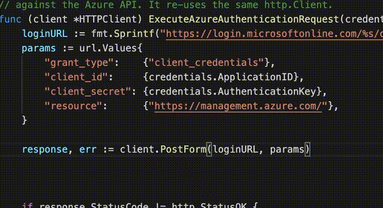

# Go Boost
Provides a boost to your go development. 

Currently the only feature is autocomplete for the tendious if err != nil. Hopefully this a bit more useful/less work than a snippet.

Demo 

https://marketplace.visualstudio.com/items?itemName=neibla.go-boost

## Release Notes

### 0.0.5
Reduced autocomplete trigger to "i" as with it was a bit annoying with returning no suggestions still made it open the snippets via registerCompletionItemProvider... 

### 0.0.4
GIF

### 0.0.3
Added "i" trigger, snippet and swaped order. 

### 0.0.2
Icon

### 0.0.1

Initial release

